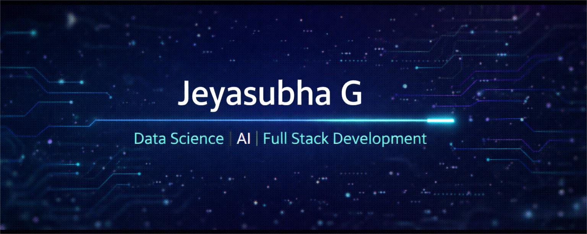

<!-- ================= HERO BANNER ================= -->

  

---

## 👨‍💻 Who Am I?

I’m a **tech-driven student** who enjoys working at the intersection of  
**Artificial Intelligence, Data Structures, and Full-Stack Development**.

I like:
- solving problems that actually matter  
- building systems that scale instead of breaking  
- learning *why* something works, not just *how*

**Short version:** I enjoy coding things that think 🤖 and apps people use 🌐

---

## ⚡ What I Work With

### 🧑‍💻 Core Languages

  

### 🎨 Frontend Skills

  

### ⚙ Backend, AI & Frameworks

  

### 🗄 Databases & Tools

  

---

## 🚀 Things I’ve Built

### 🧠 Smart Campus ID System
**Tech:** Python · OpenCV · Deep Learning · Flask  
- Face recognition based attendance system  
- Centralized backend for student records  
- Visual dashboard for tracking attendance  

---

### 🧩 Mind Map Generator (Topic Tree Creator)
**Tech:** Python · NLP · FastAPI  
- Converts paragraphs into structured mindmaps  
- Extracts key concepts automatically  
- Helps with faster learning & revision  

---

### ✅ Interactive To-Do Web App
**Tech:** HTML · CSS · JavaScript  
- Dynamic task creation & editing  
- Priority handling + drag & drop  
- Persistent storage using LocalStorage  

---

## 📊 Progress & Consistency

  

  

---

## 🧊 Commit Visualization

  

---

## 🏆 Highlights

- 💡 Regular problem solver on coding platforms  
- 🧠 Hands-on AI & ML project experience  
- 🔧 Comfortable with end-to-end development  
- 📊 Strong interest in data-driven systems  

---

## 🧑‍💻 Coding Profiles

  
  &nbsp;&nbsp;
  
  &nbsp;&nbsp;
  

  

---

## 🤝 Let’s Connect

  
  &nbsp;&nbsp;
  

  <em>Learning daily. Building consistently. Improving relentlessly.</em>

