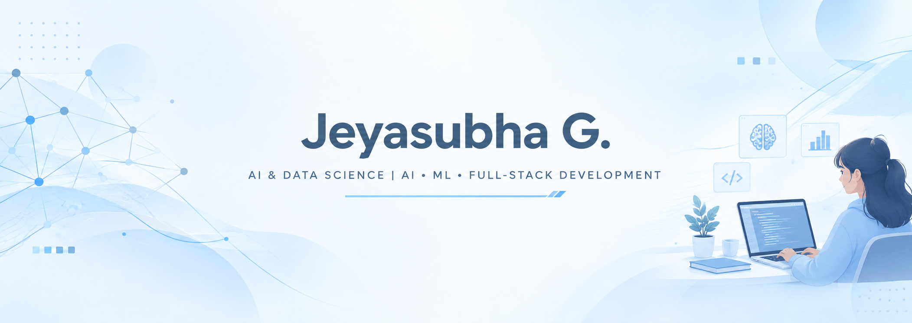
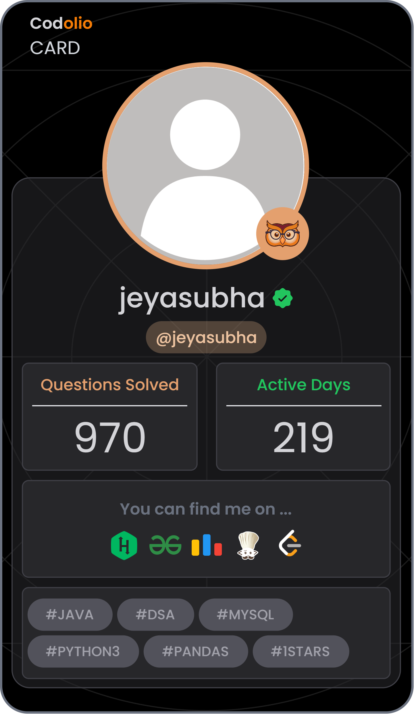

 

### AI & ML · Data Science · Full-Stack Development

 

 

## About Me

I'm an Artificial Intelligence & Data Science student who enjoys building intelligent, practical, and user-focused software systems.

My interests span AI, Machine Learning, NLP, Data Science, and Full-Stack Development, with hands-on experience building projects ranging from facial-recognition and recommendation systems to AI-powered learning applications.

I also enjoy problem solving and competitive programming, continuously strengthening my understanding of algorithms and software engineering fundamentals. Currently, I'm focused on learning, building, and exploring AI Engineering.

 

## Quick Profile

|   |   |
|---|---|
| **Degree** | B.Tech, Artificial Intelligence & Data Science |
| **Institution** | KIT — Kalaignar Karunanidhi Institute of Technology |
| **Duration** | 2023 – 2027 |
| **Interests** | AI Engineering · Machine Learning · NLP · Data Science · Full-Stack Development |

 

## Technical Skills

**Languages**
 
    

**AI / ML / Data**
 
`NumPy` · `Pandas` · `Scikit-learn` · `TensorFlow / Keras` · `PyTorch` · `NLP`

**Frontend**
 
    

**Backend**
 
   · `REST APIs`

**Databases**
 

**Tools**
 
   

**Concepts**
 
`Data Structures & Algorithms` · `OOP` · `Machine Learning` · `Deep Learning`

 

## Experience

**Machine Learning / AI Training**
 
*Manfree Technologies, Coimbatore — December 2024*

Hands-on training in Python, Machine Learning, and Deep Learning, working with Scikit-learn and TensorFlow/Keras. Focused on data preprocessing, API integration, and end-to-end model implementation.

 

**Full-Stack Development Internship**
 
*LearnLogicify Technologies, Coimbatore — July 2025*

Developed an integrated study website — a responsive full-stack application covering frontend, backend, and database integration. Implemented authentication, study-resource management, and To-Do functionality using REST APIs, along with deployment and environment configuration.

 

## Featured Projects

<table>
<tr>
<td width="50%" valign="top">

### Smart ID System for Campus Access

Real-time facial-recognition based attendance and access system that identifies registered students from live camera input using facial embeddings, and manages records through a backend dashboard.

**Stack:** Python · OpenCV · DeepFace · FaceNet · Deep Learning · Flask

- Real-time face recognition from continuous camera input
- Embedding-based similarity matching
- Flask backend with student data management
- Attendance visualization dashboard

</td>
<td width="50%" valign="top">

### Movie Recommendation System

A recommendation engine built using collaborative filtering and similarity-based approaches on the MovieLens dataset.

**Stack:** Python · Machine Learning · Pandas

- User-item interaction matrices
- User-user and item-item recommendation
- RMSE-based evaluation
- Built collaboratively as a team project

</td>
</tr>
<tr>
<td width="50%" valign="top">

### Mindmap Generator from Paragraphs

An AI-powered learning platform that transforms uploaded content into summaries, explanations, keywords, and structured topic breakdowns.

**Stack:** Python · NLP · Transformers · React.js · AI APIs

- NLP-driven automated summarization
- Keyword extraction and topic breakdown
- AI model API integration
- React-based user interface

</td>
<td width="50%" valign="top">

### Interactive To-Do Web App

A lightweight task management app with dynamic creation, editing, and priority handling.

**Stack:** HTML · CSS · JavaScript

- Drag-and-drop task organization
- Priority-based task handling
- Persistent local storage

</td>
</tr>
</table>

 

## Problem Solving

|  | Max Rating | Problems Solved | Highlights |
|---|---|---|---|
| **LeetCode** | 1974 | 417 | Top 2.99% · Knight Badge · 44 Contests · 11 Badges |
| **CodeChef** | 1529 | 203 | Highest Rank 326, Starters 229 |

 

## Coding Profiles

      

 

 

## GitHub Activity

 

## Let's Connect

    

Building toward AI Engineering, one project at a time.

